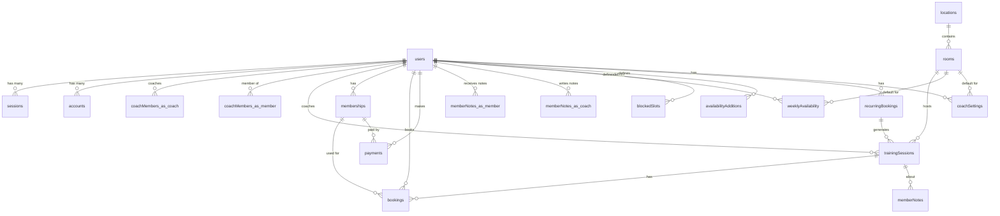

# Database Schema Documentation

This document describes the complete database schema for the Upgrade Coaching application.

## Overview

The database uses PostgreSQL with Drizzle ORM and is structured into two main domains:
1. **Authentication & User Management** - Better Auth tables for user authentication
2. **Gym Management** - Training sessions, bookings, memberships, and payments

---

## Entity Relationship Diagram

---

## Tables by Domain

### 🔐 Authentication & Identity

#### `users`
Core user table for all application users (members, coaches, owners).

| Column | Type | Description |
|--------|------|-------------|
| id | text (UUID) | Primary Key |
| email | varchar(255) | Unique, Not Null |
| emailVerified | boolean | Default false |
| name | varchar(255) | |
| image | text | |
| dateOfBirth | varchar(10) | YYYY-MM-DD |
| sex | varchar(20) | |
| phone | varchar(20) | |
| role | varchar(20) | Default 'member' (member/coach/owner) |
| hasCompletedOnboarding | boolean | Default false |
| defaultCoachId | text | FK -> users.id (Self-reference) |
| createdAt | timestamp | |
| updatedAt | timestamp | |

#### `sessions`
Active user sessions managed by Better Auth.

| Column | Type | Description |
|--------|------|-------------|
| id | text (UUID) | Primary Key |
| token | text | Unique, Session Token |
| expiresAt | timestamp | |
| userId | text | FK -> users.id |
| ipAddress | text | |
| userAgent | text | |

#### `accounts`
OAuth providers and password authentication.

| Column | Type | Description |
|--------|------|-------------|
| id | text (UUID) | Primary Key |
| userId | text | FK -> users.id |
| accountId | text | External Account ID |
| providerId | text | Provider (google, apple, etc) |
| password | text | Hashed password |

#### `verifications`
Email verification codes.

| Column | Type | Description |
|--------|------|-------------|
| id | text (UUID) | Primary Key |
| identifier | text | Email/Phone |
| value | text | Code/Token |
| expiresAt | timestamp | |

---

### 🏋️ Gym Management Domain

#### `locations`
Physical gym locations.

| Column | Type | Description |
|--------|------|-------------|
| id | text (UUID) | Primary Key |
| name | varchar(255) | |
| address | text | |
| city | varchar(100) | |
| country | varchar(100) | |

#### `rooms`
Rooms within locations.

| Column | Type | Description |
|--------|------|-------------|
| id | text (UUID) | Primary Key |
| locationId | text | FK -> locations.id |
| name | varchar(255) | |
| capacity | integer | |
| isActive | boolean | Default true |

#### `coachMembers`
Coach-Member relationships.

| Column | Type | Description |
|--------|------|-------------|
| id | text (UUID) | Primary Key |
| coachId | text | FK -> users.id |
| memberId | text | FK -> users.id |
| status | varchar(20) | Default 'ACTIVE' |

#### `trainingSessions`
Bookable training sessions.

| Column | Type | Description |
|--------|------|-------------|
| id | text (UUID) | Primary Key |
| coachId | text | FK -> users.id |
| roomId | text | FK -> rooms.id |
| type | enum | ONE_TO_ONE, GROUP |
| title | varchar(255) | |
| description | text | |
| startTime | timestamp | |
| endTime | timestamp | |
| capacity | integer | |
| status | enum | scheduled, completed, cancelled, no_show |
| notes | text | |
| duration | integer | Minutes |
| weekdays | jsonb | Array of day numbers |
| isRecurring | boolean | |
| recurrenceEndDate | timestamp | |
| recurringBookingId | text | FK -> recurringBookings.id |
| oneTimeBookingId | text | FK -> bookings.id (soft link) |
| memberId | text | FK -> users.id |

#### `memberships`
Member subscriptions/packs.

| Column | Type | Description |
|--------|------|-------------|
| id | text (UUID) | Primary Key |
| memberId | text | FK -> users.id |
| type | enum | PACK, SUBSCRIPTION, SINGLE |
| name | varchar(255) | |
| sessionsTotal | integer | Null = unlimited |
| sessionsUsed | integer | Default 0 |
| startDate | date | |
| endDate | date | |
| isActive | boolean | Default true |

#### `bookings`
Member reservations.

| Column | Type | Description |
|--------|------|-------------|
| id | text (UUID) | Primary Key |
| sessionId | text | FK -> trainingSessions.id |
| memberId | text | FK -> users.id |
| status | enum | CONFIRMED, CANCELLED_BY_MEMBER, etc |
| membershipId | text | FK -> memberships.id |
| cancelledAt | timestamp | |

#### `payments`
Payment records.

| Column | Type | Description |
|--------|------|-------------|
| id | text (UUID) | Primary Key |
| memberId | text | FK -> users.id |
| membershipId | text | FK -> memberships.id |
| amountCents | integer | |
| currency | varchar(3) | Default EUR |
| status | enum | PENDING, PAID, FAILED, REFUNDED |

#### `memberNotes`
Notes on members.

| Column | Type | Description |
|--------|------|-------------|
| id | text (UUID) | Primary Key |
| memberId | text | FK -> users.id |
| coachId | text | FK -> users.id |
| sessionId | text | FK -> trainingSessions.id |
| note | text | |

---

### 📅 Availability & Scheduling

#### `coachSettings`
Coach-specific preferences.

| Column | Type | Description |
|--------|------|-------------|
| id | text (UUID) | Primary Key |
| coachId | text | FK -> users.id |
| defaultRoomId | text | FK -> rooms.id |
| defaultDuration | integer | Default 60 |

#### `weeklyAvailability`
Weekly recurring availability template.

| Column | Type | Description |
|--------|------|-------------|
| id | text (UUID) | Primary Key |
| coachId | text | FK -> users.id |
| dayOfWeek | integer | 0=Sunday, 1=Monday... |
| startTime | varchar(5) | HH:MM |
| endTime | varchar(5) | HH:MM |
| duration | integer | |
| isIndividual | boolean | |
| isGroup | boolean | |
| roomId | text | FK -> rooms.id |

#### `blockedSlots`
Time slots where coach is unavailable.

| Column | Type | Description |
|--------|------|-------------|
| id | text (UUID) | Primary Key |
| coachId | text | FK -> users.id |
| startTime | timestamp | |
| endTime | timestamp | |
| reason | text | |

#### `availabilityAdditions`
Extra availability slots (one-offs).

| Column | Type | Description |
|--------|------|-------------|
| id | text (UUID) | Primary Key |
| coachId | text | FK -> users.id |
| startTime | timestamp | |
| endTime | timestamp | |
| roomId | text | FK -> rooms.id |
| isIndividual | boolean | |
| isGroup | boolean | |
| reason | text | |

#### `recurringBookings`
Recurring reservations for members.

| Column | Type | Description |
|--------|------|-------------|
| id | text (UUID) | Primary Key |
| memberId | text | FK -> users.id |
| coachId | text | FK -> users.id |
| dayOfWeek | integer | |
| startTime | varchar(5) | |
| endTime | varchar(5) | |
| startDate | date | |
| endDate | date | |
| frequency | integer | Default 1 (weekly) |
| status | enum | ACTIVE, CANCELLED |

---

## Enums

- **session_type**: ONE_TO_ONE, GROUP
- **session_status**: scheduled, completed, cancelled, no_show
- **booking_status**: CONFIRMED, CANCELLED_BY_MEMBER, CANCELLED_BY_COACH, NO_SHOW, WAITLIST
- **recurring_booking_status**: ACTIVE, CANCELLED
- **membership_type**: PACK, SUBSCRIPTION, SINGLE
- **payment_status**: PENDING, PAID, FAILED, REFUNDED

